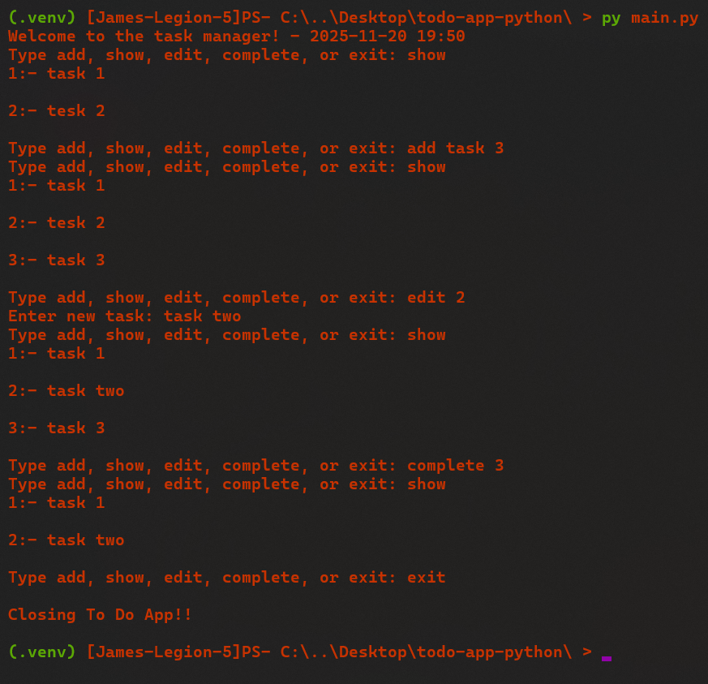
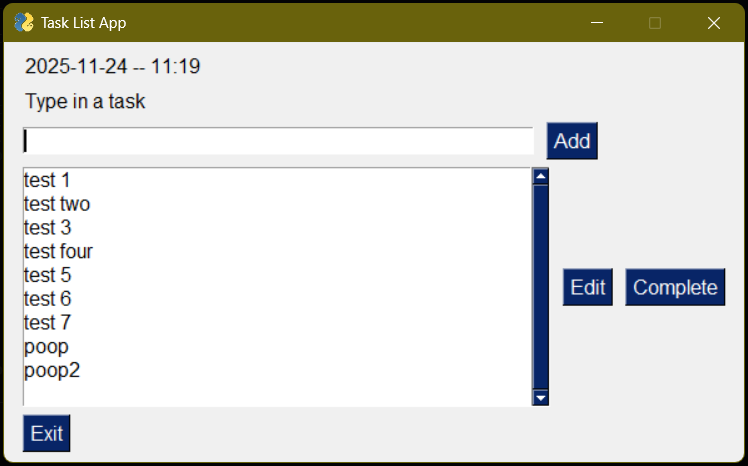
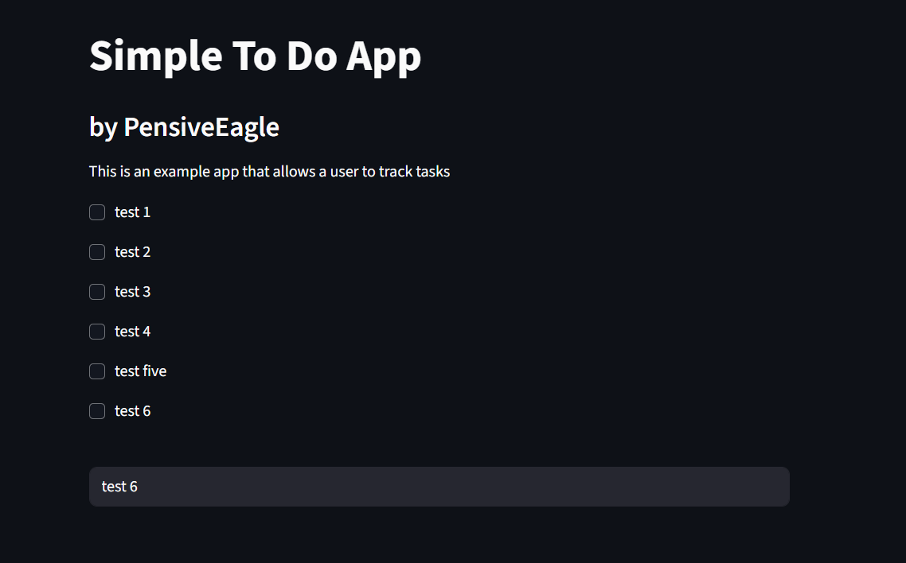

<!-- PROJECT SHIELDS -->
[![Contributors][contributors-shield]][contributors-url]
[![Forks][forks-shield]][forks-url]
[![Stargazers][stars-shield]][stars-url]
[![Issues][issues-shield]][issues-url]
[![project_license][license-shield]][license-url]
[![LinkedIn][linkedin-shield]][linkedin-url]


<!-- PROJECT LOGO -->
<br />
<div align="center">
  <a href="https://github.com/PensiveEagle/" target="_blank">
    
  </a>

<h3 align="center">Simple To-Do App</h3>

  <p align="center">
    This is a simple to-do application written in Python with three user interfaces, CLI, desktop GUI, and a webapp.
    <br />
    <a href="https://github.com/PensiveEagle/todo-app-python/docs"><strong>Explore the docs »</strong></a>
    <br />
    <br />
    <a href="https://github.com/PensiveEagle/todo-app-python">View Demo</a>
    &middot;
    <a href="https://github.com/PensiveEagle/todo-app-python/issues/new?labels=bug&template=bug-report---.md">Report Bug</a>
    &middot;
    <a href="https://github.com/PensiveEagle/todo-app-python/issues/new?labels=enhancement&template=feature-request---.md">Request Feature</a>
  </p>
</div>


<!-- TABLE OF CONTENTS -->
<details>
  <summary>Table of Contents</summary>
  <ol>
    <li>
      <a href="#about-the-project">About The Project</a>
      <ul>
        <li><a href="#built-with">Built With</a></li>
      </ul>
    </li>
    <li>
      <a href="#getting-started">Getting Started</a>
      <ul>
        <li><a href="#prerequisites">Prerequisites</a></li>
        <li><a href="#installation">Installation</a></li>
      </ul>
    </li>
    <li><a href="#usage">Usage</a></li>
    <li><a href="#roadmap">Roadmap</a></li>
    <li><a href="#contributing">Contributing</a></li>
    <li><a href="#license">License</a></li>
    <li><a href="#contact">Contact</a></li>
    <li><a href="#acknowledgments">Acknowledgments</a></li>
  </ol>
</details>


<!-- ABOUT THE PROJECT -->
## About The Project

This project is a basic personal learning project that I have built to practice my Python skills.

It is a simple To-Do tracking application that allows a user to add and complete tasks.

The application comes with the ability to use three user interfaces, a CLI text only interface, a GUI interface creating using (insert package here), and a WebApp interface using StreamLit.

#### CLI


#### Desktop GUI


#### WebApp Interface


<p align="right">(<a href="#readme-top">back to top</a>)</p>


### Built With

[![Python][python-shield]][python-url]
[![Streamlit][streamlit-shield]][streamlit-url]

<p align="right">(<a href="#readme-top">back to top</a>)</p>


<!-- GETTING STARTED -->
## Getting Started

This is an example of how you may give instructions on setting up your project locally.
To get a local copy up and running follow these simple example steps.

### Prerequisites

To run this you need to have Python 3.14 or greater, the pip python package installer, or Docker to run the programmes in Docker containers

### Installation - Local

The various versions of this application can be run locally on a machine with a compatible version of Python installed

1. Clone the repo
   ```sh
   git clone https://github.com/PensiveEagle/todo-app-python.git
   ```
2. Jump into the app directory
   ```sh
   cd todo-app-python
   ```
3. Create a python virtual environment
   ```sh
   python -m venv .venv
   ```
4. Launch the venv
   ```sh
   .venv/scripts/activate.ps1
   ```
5. Install packages
   ```sh
   pip install -r requirements.txt
   ```

### Installation - Docker

The CLI and Web App versions of this application can also be run using Docker containers

1. Clone the repo
   ```sh
   git clone https://github.com/PensiveEagle/todo-app-python.git
   ```
2. Jump into the app directory
   ```sh
   cd todo-app-python
   ```
3. Build the Docker images
   ```sh
   docker build -t todo-cli-version -f cli_version.dockerfile .
   docker build -t todo-web-version -f web_version.dockerfile .
   ```


<p align="right">(<a href="#readme-top">back to top</a>)</p>


<!-- USAGE EXAMPLES -->
## Usage

### Local Usage

#### CLI Version
1. Launch the venv
   ```sh
   .venv/scripts/activate.ps1
   ```
2. Run the app
   ```sh
   python cli_main.py
   ``` 

#### GUI Version
1. Launch the venv
   ```sh
   .venv/scripts/activate.ps1
   ```
2. Run the app
   ```sh
   python gui_main.py
   ```

#### Webapp Version
1. Launch the venv
   ```sh
   .venv/scripts/activate.ps1
   ```
2. Run the app
   ```sh
   streamlit run web_main.py
   ```

### Docker Usage
 
#### CLI Version
1. Run docker container
   ```sh
   docker run -it --rm --name cli-todo-app todo-cli-version
   ```

#### Webapp Version
1. Run docker container
   ```sh
   docker run --rm -d --name web-todo-app -p 8080:8080 todo-web-version
   ```
2. Visit localhost:8080 in your web browser


<p align="right">(<a href="#readme-top">back to top</a>)</p>


<!-- ACKNOWLEDGMENTS -->
## Acknowledgments

* []()

<p align="right">(<a href="#readme-top">back to top</a>)</p>

<div align="center"></div>


<!-- MARKDOWN LINKS & IMAGES -->
<!-- https://www.markdownguide.org/basic-syntax/#reference-style-links -->
[contributors-shield]: https://img.shields.io/github/contributors/PensiveEagle/todo-app-python.svg?style=for-the-badge
[contributors-url]: https://github.com/PensiveEagle/todo-app-python/graphs/contributors
[forks-shield]: https://img.shields.io/github/forks/PensiveEagle/todo-app-python.svg?style=for-the-badge
[forks-url]: https://github.com/PensiveEagle/todo-app-python/network/members
[stars-shield]: https://img.shields.io/github/stars/PensiveEagle/todo-app-python.svg?style=for-the-badge
[stars-url]: https://github.com/PensiveEagle/todo-app-python/stargazers
[issues-shield]: https://img.shields.io/github/issues/PensiveEagle/todo-app-python.svg?style=for-the-badge
[issues-url]: https://github.com/PensiveEagle/todo-app-python/issues
[license-shield]: https://img.shields.io/github/license/PensiveEagle/todo-app-python.svg?style=for-the-badge
[license-url]: https://github.com/PensiveEagle/todo-app-python/blob/master/LICENSE.txt
[linkedin-shield]: https://img.shields.io/badge/-LinkedIn-black.svg?style=for-the-badge&logo=linkedin&colorB=555
[linkedin-url]: https://linkedin.com/in/jameshall-profile
[gui-screenshot]: docs/assets/gui-screenshot.png
[webapp-screenshot]: docs/assets/webapp-screenshot.png
[python-shield]: https://img.shields.io/badge/python-3776AB?style=for-the-badge&logo=python&logoColor=white
[python-url]: https://python.org/
[streamlit-shield]: https://img.shields.io/badge/streamlit-FF4B4B?style=for-the-badge&logo=streamlit&logoColor=white
[streamlit-url]: https://streamlit.io/
